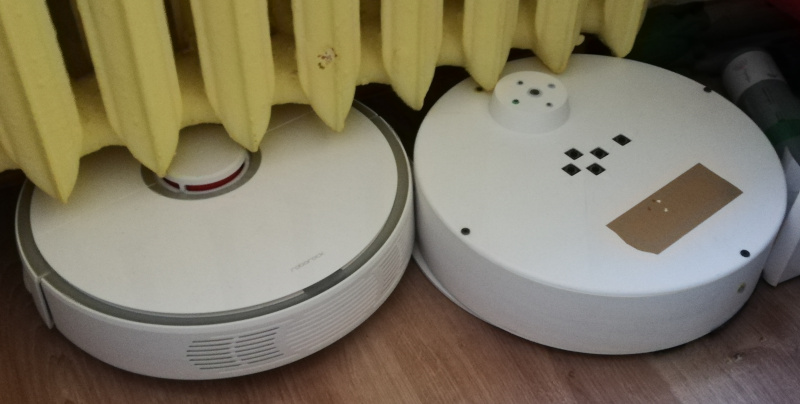
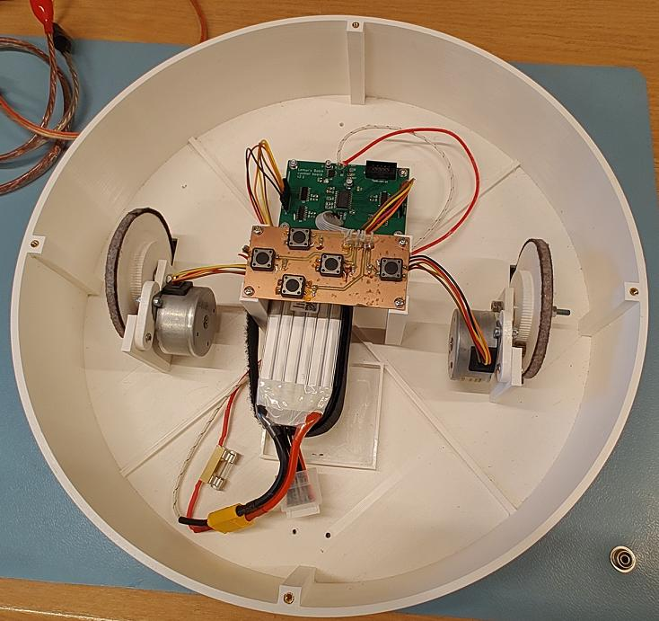
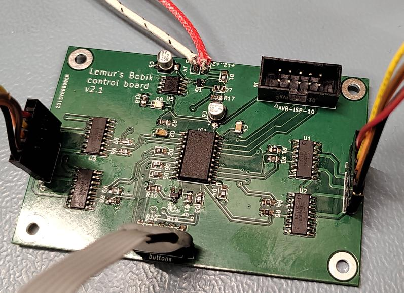

# Lemur's Bobik

project of a toy for a 3-5 year child, that is aimed at learning basic programming skills.
robot has 4 buttons for programming directions and one button to start it.

program is generated by a sequence of buttons pressed (eg. forward, forward, left).
after pressing "start" button, robot begins execution of a given sequence.
its programming is thus similar to Logo programming language, but does not require one to be able to read/write, or spending time in front of the screen.

robot's body is designed to mimic a bit autonomic vacuum cleaner robots, that children know and love. :)






## HW parts

* 2x unipolar stepper motors (M42SP-5M - from old desktop printer)
* 12x M3x10 screws
* 12x M3 threaded inserts
* velcro for holding LiPo pack in place (length according to your LiPo size)


## 3D printed parts

`seal` is supposed to be printed in TPU.
after printing, it shall be glued to a `bottom` part with CA glue.
without gluing it will be very hard to put things in place.

all the other elements can be printed in pretty much anything.
my build was just in regular, white PLA.

it's recommend to put some felt under from and rear edges of the bottom part.
it's also worth gluing a thin strip of felt around wheels' external circumference.
this will protect floors from sharp edges and decrease the amount of noise, on flat floors.

while the `seal` is optional, it's highly recommended to silence vibrations.


## electronics



for electronic components checkout BOM, generated by builds, namely:
```
board/hw/control/build/bom.csv
board/hw/buttons/build/bom.csv
```


## known issues


### engines are hard to mount

screws (especially bottom one) are hard to reach.
in a hindsight whole engine-wheel module should have been reworked.
engines could drive wheels directly, and me mounted with threaded inserts.
this would simplify things a lot, and removed noisy gears altogether.


### missing visual feedback

on top panel there should be more LEDs.
these shall indicate:
* button press recorded (possible with dir)
* powered-on state
* low battery state


### batter status

it should be possible to check batter status w/o opening enclosure and disconnecting it.
currently it's very absorbing and inconvenient.


### OAT

programming via AVR's ISP is annoying and requires disassembly.
as of writing these words (HW v2.1) it also requires unplugging main battery (to be fixed in next HW release).
OTA re-flashing would be an improvement.


### debugability

ATtinty2313 in current setting does not have enough pins to provide any feedback (even LED blinking).
more powerful µC should be used instead, that'd allow for serial (or BTLE) port debugging, to monitor state.
on top of that in-system `gdb` would save time for finding stupid mistakes.
this would greatly simplify finding issues and diagnosing inconveniences, that currently require a lot of fuss and re-flashing.


### need better engines

desktop printer engines used require unusual voltage (here: 24V, 0.35A).
they are also quite weak (here: can easily be stopped with 2 fingers).
more powerful NEMA 17 engines would be far superior choice.
using bipolar steppers would also allow to use off the shelve stepper drivers and provide more torque.
